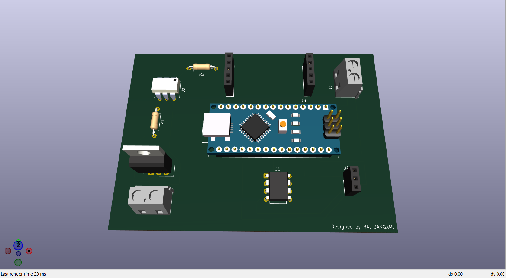
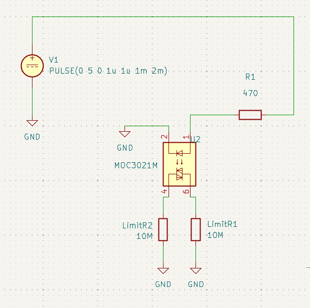
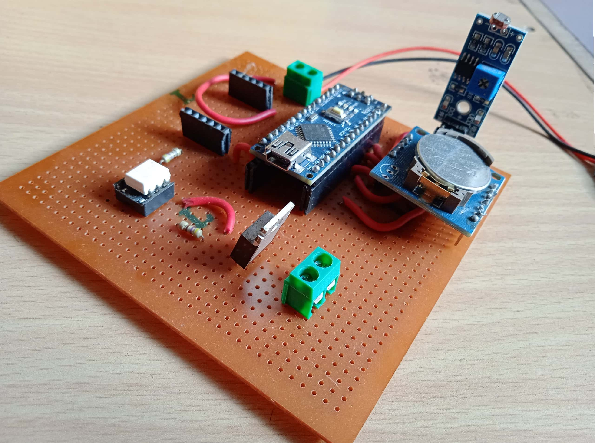

# Efficient Street Lighting System 

### Introduction

This was my academic project focused on creating a efficient LED based Street Lighting System which will avoid Power Wastage due to manual mismanagement.

### Motivation

I have observed many times that street lights were ON till 10 AM because operator forgot shut the main switch down and seen this very frequently & also lights were ON
1/2 hrs before SUNSET which leads to Power Wastage this is the Main reason or motivation behind this project.

### Objectives

1.	To make sure that all street lights will remain ON only during **DARK (Cloudy Condition)/NIGHT hours** & will remain off completely during **DAY HOURS (from Sunrise to Sunset)**.
2.	In case, If Power remains ON during Day-Time due to operators negligence LED lights will still remain OFF contributing to Energy saving.
3.	To Improve life of street light lamps.
4.	To Achieve Maximum Energy Efficiency. 

## System Design

### Components

| Component           | Purpose                             |
| -------------       | ----------------------------------- |
| **Arduino Nano**       | Microcontroller control unit        |
| **DS1307 - RTC Module** | Time scheduling                     |
| **MOC3021**             | Opto-isolated TRIAC driver          |
| **BT136 - TRIAC**       | AC load switching                   |
| **LDR Module**         | Detects ambient light intensity (luminance) |
| **470Ω Resistor**      | Limits current into optocoupler LED |

### Schematic Design

> The schematic is designed in KiCad. Schematic consists Arduino Nano (Control Unit), DS1307 RTC Module, optocoupler driver (MOC3021), BT136 TRIAC (switching circuit) for AC load along with Resistors.

### PCB Layout

> The PCB layout separates the low-voltage control circuitry from the AC power section to maintain electrical isolation. Routing was optimized to keep the power path short and reduce noise coupling.

### 3D View

### Design considerations

- **Isolation between low-voltage control circuit and AC mains section.**  
- **Clear routing of power paths for the TRIAC switching stage.**  
- **Through-hole components used for easier prototyping and soldering.**

## Circuit Simulation

### ngspice Simulation
**Transient analysis** was performed using ngspice integrated in KiCad to validate the Arduino driver stage.

> ### Limitation
> **Since microcontrollers cannot be simulated directly in SPICE, the Arduino PWM output was emulated using a pulse voltage source.**

- ### Simulated Circuit

- ### PWM Signal Emulation

All required Arduino PWM signals were emulated using the SPICE source :

Example : **PULSE(0 5 0 1u 1u 1m 2m)**
| Parameter    | Value |
| ------------ | ----- |
| Low Voltage  | 0 V   |
| High Voltage | 5 V   |
| Rise Time    | 1 µs |
| Fall Time    | 1 µs |
| ON Time      | 1 ms  |
| Period       | 2 ms  |

This results in a 50% duty cycle PWM signal, which corresponds to the Arduino command:

`analogWrite(pin,128)`

- ### Transient Analysis Results

The transient simulation produced the following waveform.

**Observations from the simulation** :
- The voltage waveform alternates between 0 V and 5 V, representing the PWM output.
- The current through the resistor and LED appears as periodic pulses synchronized with the PWM signal.

> **Calculation** :
>
> **I = (Vcc − Vf) / R**
>
> **Vcc** = 5 V, **Vf** ≈ 1.2 V (LED forward voltage), **R** = 470 Ω
>
> I ≈ (5 − 1.2) / 470
> 
> **I ≈ 8 mA**

- **The simulated current (~9.1 mA) aligns with this calculation and confirms that the Arduino output pin can safely drive the optocoupler input stage.**

### Proteus Simulation

To verify the embedded firmware behavior, the system was simulated in **Proteus**.

Unlike SPICE tools, Proteus allows simulation of **Arduino code execution along with peripheral modules such as the RTC**.

Simulation demonstrates and displays output Oscilloscope how the Arduino program changes the **output signal according to the RTC time conditions**.

### Simulation Outputs

- #### At Mid-Day Time

- #### At Evening Time

- #### At Night

- #### At Early Morning

- #### At Morning

These results confirm that the firmware correctly generates the expected control signal based on RTC timing conditions. Using the same logic then implemented and validated on the physical hardware prototype.
__________
## Hardware Implementation

The circuit is implemented on a custom PCB designed in KiCad. 
The circuit board includes the Arduino Nano module, RTC module, LDR sensor module, MOC3021 optocoupler, 470Ω resistor, connectors, and a BT136 TRIAC.

The Arduino Nano is mounted on the PCB and programmed to execute the control logic based on RTC timing conditions. After assembling the PCB, the logic was tested on a working prototype to validate the system behaviour of the control stage.

### PCB

### Prototype

## Results

**The hardware prototype was tested at different time conditions defined in the firmware.
The observed outputs confirm that the system correctly generates the control signal and operates as intended.**

- #### 1. During Day Time

- #### 2. At Evening

- #### 3. At Peak Night Hours

- #### 4. During Cloudy Conditions

